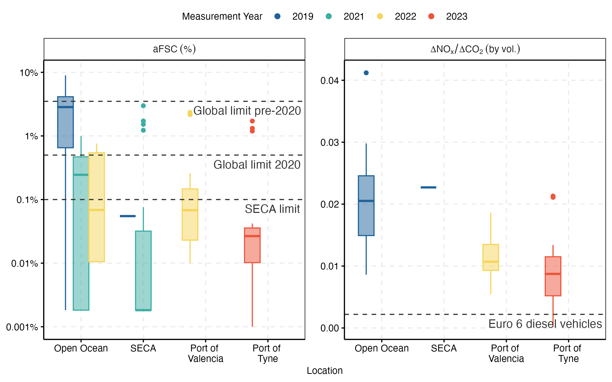

# SO2 and NOx emissions from European shipping: in situ measurements and comparison with an emission model

Data processing code for the research paper "SO2 and NOx emissions from European shipping: in situ measurements and comparison with an emission model"

There are three main steps to the code:

1. Scripts 0_1 and 0_2 download and merge [Facility for Airborne Atmospheric Measurement](https://www.faam.ac.uk/) data from the [Centre for Environmental Data Analysis](https://www.ceda.ac.uk/) using the [faamr](https://github.com/wacl-york/faamr) package.

2. 1_0 to 3_0 perform the sulphur fuel content calculations using [ACRUSIE-peakid](https://github.com/wacl-york/acruise-peakid)

3. 4_0 to 5_4 combine the aircraft data with the Wolfson Atmospheric Chemistry Laboratories Air Sampling Platform (WASP) and produce the plots

